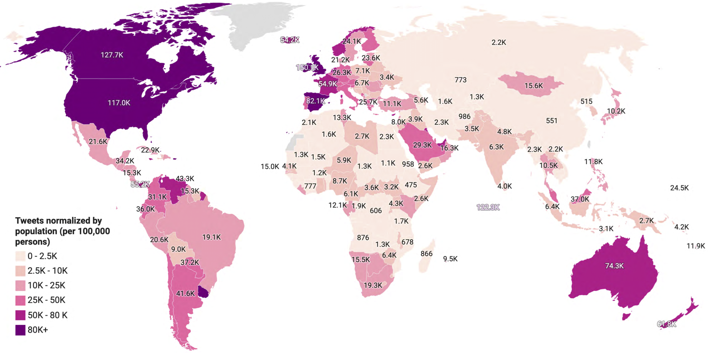

# TBCOV: Two Billion Multilingual COVID-19 Tweets with Sentiment, Entity, Geo, and Gender Labels
Welcome to the code repository for the TBCOV dataset. This code repository offers several scripts helpful to hydrate and process the shared dataset.

The TBCOV dataset comprises more than two billion tweets from 218 countries worldwide. The following map shows worldwide tweets normalized by the total population from each country per 100,000 persons.

# Data descriptor for base release files
|Attribute|Type|Description|
|--- |--- |--- |
|tweet_id|Int64|The integer representation of the unique identifier a tweet. This number is greater than 53 bits and some programming languages may have difficulty/silent defects in interpreting it.|
|date_time|String|UTC time when the tweet was created.|
|lang|String|ISO-6391 Alpha-2 language code consisting of two characters.|
|user_id|String|Represents the id of the author of the tweet.|
|retweeted_id|Int64|If the tweet is a retweet, the retweeted_id represents the id of the parent tweet.|
|quoted_id|Int64|If the tweet is a quoted tweet, the quoted_id represents the id of the parent tweet.|
|in_reply_to_id|Int64|If the tweet is a reply to an existing tweet, the in_reply_to_id represents the id of the parent/original tweet.|
|sentiment_label|Int64|Represents the sentiment label values: -1 (negative), 0 (neutral), 1 (positive).|
|sentiment_conf|Float|Represents the confidence score of the sentiment classifier for a given sentiment label to a tweet.|
|user_type|String|The user types represents the identified type of the user such as person, organization, location, etc.|
|gender_label|String|One character code representing the identified gender of the users. F represents "female" and M represents "male" user types.|
|tweet_text_named_entities|Dictionary array|Named-entities (persons, organizations, locations, etc.) extracted from tweet text are provided in this attribute in the array of dictionary format.|
|geo_coordinates_lat_lon|Float|GPS coordinates in the latitude, longitude format retrieved from the user's GPS-enabled device.|
|geo_country_code|String|Two characters country code learned through resolving the GPS coordinates (latitude, longitude).|
|geo_state|String|The name of the state/province learned through resolving the GPS coordinates (latitude, longitude).|
|geo_county|String|The name of the county learned through resolving the GPS coordinates (latitude, longitude).|
|geo_city|String|The name of the city learned through resolving the GPS coordinates (latitude, longitude).|
|place_bounding_box|Float|Twitter provided bounding boxes representing place tags.|
|place_country_code|String|Two characters country code learned through resolving the place bounding boxes.|
|place_state|String|The name of the state/province learned through resolving the place bounding boxes.|
|place_county|String|The name of the county learned through resolving the place bounding boxes.|
|place_city|String|The name of the city learned through resolving the place bounding boxes.|
|user_loc_toponyms|Dictionary array|Toponyms recognized and extracted from the user location field provided as an array of dictionary.|
|user_loc_country_code|String|Two characters country code learned through resolving the user location toponyms.|
|user_loc_state|String|The name of the state/province learned through resolving the user location toponyms.|
|user_loc_county|String|The name of the county learned through resolving the user location toponyms.|
|user_loc_city|String|The name of the city learned through resolving the user location toponyms.|
|user_profile_description_toponyms|Dictionary array|Toponyms recognized and extracted from the user profile description field provided as an array of dictionary.|
|user_profile_description_country_code|String|Two characters country code learned through resolving the recognized user profile description toponyms.|
|user_profile_description_state|String|The name of the state/province learned through resolving the recognized user profile description toponyms.|
|user_profile_description_county|String|The name of the county learned through resolving the recognized user profile description toponyms.|
|user_profile_description_city|String|The name of the city learned through resolving the recognized user profile description toponyms.|
|tweet_text_toponyms|Dictionary array|Toponyms recognized and extracted from the tweet full_text field in the dictionary array format.|
|tweet_text_country_code|String|Two characters country code learned through resolving the recognized tweet text toponyms.|
|tweet_text_state|String|The name of the state/province learned through resolving the recognized tweet text toponyms.|
|tweet_text_county|String|The name of the county learned through resolving the recognized tweet text toponyms.|
|tweet_text_city|String|The name of the city learned through resolving the recognized tweet text toponyms.|

# Tweets hydration
The tweets hydration process fetches full tweet content from Twitter using tweet-ids. To assist users with hydrating TBCOV tweets, this code reposity
provides a tool written in the Java language that takes tweet-ids as input and retrieves full tweet content from Twitter APIs. More details and a usage guide of the Tweets hydrator are available [here](https://github.com/CrisisComputing/TBCOV/tree/main/tweets_hydrator).

# Preprocessing
Different types of preprocessing were applied on different attributes before using them for any analysis. The preprocessing is important to replicate results. The code reposity provides several scripts used to preprocess different fileds. The preprocessing scripts are avaialablel [here](https://github.com/CrisisComputing/TBCOV/tree/main/preprocessing).

# Meta-data file
We are preparing a meta-data file which will be helpful to extract tweets details from the base release pertaining to a specific language or country. The meta-data file is available [here](https://github.com/CrisisComputing/TBCOV/tree/main/meta_data)

# Parsing using meta-file
We are preparing parsers that will be the meta-data file for relevant tweets extraction from the base release. Meta-data based retrieval of tweets can be performed using scripts [here](https://github.com/CrisisComputing/TBCOV/tree/main/parsers)
